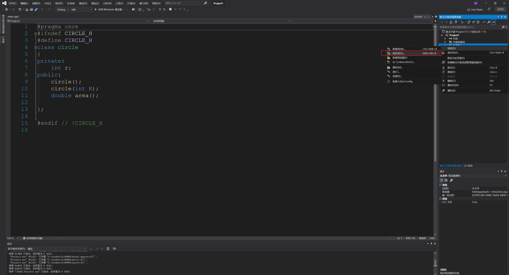

# c++头文件写法


头文件(.h)：
    写类的声明（包括类里面的成员和方法的声明）、函数原型、#define常数等，但一般来说不写出具体的实现。

    在写头文件时需要注意，在开头和结尾处必须按照如下样式加上预编译语句（如下）：

 ```c++
 #ifndef CIRCLE_H
  #define  CIRCLE_H
 
  // 你的代码写在这里
 
  #endif
 ```


 


    这样做是为了防止重复编译，不这样做就有可能出错。
    
    至于CIRCLE_H这个名字实际上是无所谓的，你叫什么都行，只要符合规范都行。原则上来说，非常建议把它写成这种形式，因为比较容易和头文件的名字对应。

   源文件（.cpp）：

    源文件主要写实现头文件中已经声明的那些函数的具体代码。需要注意的是，开头必须#include一下实现的头文件，以及要用到的头文件。那么当你需要用到自己写的头文件中的类时，只需要#include进来就行了。
    
    下面举个最简单的例子来描述一下，咱就求个圆面积。
    
     第1步，建立一个空工程（以在VS2003环境下为例）。
    
     第2步，在头文件的文件夹里新建一个名为Circle.h的头文件，它的内容如下：

 ```c++
  #ifndef CIRCLE_H
  #define  CIRCLE_H
 
  class  Circle
  {
 private:
     double r;//半径
 public:
     Circle();//构造函数
     Circle(double R);//构造函数
     double Area();//求面积函数
 } ;
 
  #endif
 ```

```c++
 #ifndef CIRCLE_H
 #define  CIRCLE_H

 class  Circle
 {
private:
    double r;//半径
public:
    Circle();//构造函数
    Circle(double R);//构造函数
    double Area();//求面积函数
} ;

 #endif
```


   注意到开头结尾的预编译语句。在头文件里，并不写出函数的具体实现。

    第3步，要给出Circle类的具体实现，因此，在源文件夹里新建一个Circle.cpp的文件，它的内容如下：

 ```c++
  #include  " Circle.h "
 
 Circle::Circle()
  {
     this->r=5.0;
 }
 
 Circle::Circle( double  R)
  {
     this->r=R;
 }
 
  double  Circle:: Area()
  {
     return 3.14*r*r;
 }
 ```


​    需要注意的是：开头处包含了Circle.h，事实上，只要此cpp文件用到的文件，都要包含进来！这个文件的名字其实不一定要叫Circle.cpp，但非常建议cpp文件与头文件相对应。

    最后，我们建一个main.cpp来测试我们写的Circle类，它的内容如下：

 ```c++
  #include  < iostream >
 #include  " Circle.h "
  using   namespace  std;
 
  int  main()
  {
     Circle c(3);
     cout<<"Area="<<c.Area()<<endl;
     return 1;
 }
 ```


​    注意到开头时有#include "Circle.h"的声明，证明我们使用到了我们刚才写的Circle类。

   至此，我们工程的结构为：


    运行一下，输出结果为：


   说明我们写的Circle类确实可以用了。

## code by myself:

```c++
//create a new file named main.cpp
#include<iostream>
#include"circle.h"
using namespace std;
int main()
{
	circle c1(30);
	cout<<c1.area();
	return 0;
}
```

```c++
//create a new file named circle.cpp

#include "circle.h"

circle::circle()
{
	this->r = 10;
}
circle::circle(int R)
{
	this->r = R;
}
double circle::area()
{
	double ar = 3.14 * r * r;
	return ar;

}
```


```c++

//create a new file named circle.h
#pragma once
#ifndef CIRCLE_H
#define CIRCLE_H
class circle
{
private:
	int r;
public:
	circle();
	circle(int R);
	double area();

};

#endif // !CIRCLE_H

```

then if you want to run these files, you can create a new project in visualstusio. then you can add these files into this new project. just as follows:




## 头文件中几个固定的词的意思

###  [C/C++中#pragma once的使用](https://www.cnblogs.com/jiu0821/p/9405027.html)

在C/C++中，为了避免同一个文件被include多次，有两种方式：一种是#ifndef方式，一种是#pragma once方式(在头文件的最开始加入)。

[](javascript:void(0);)

```c++
#ifndef SOME_UNIQUE_NAME_HERE
#define SOME_UNIQUE_NAME_HERE


// contents of the header

...


#endif // SOME_UNIQUE_NAME_HERE
```

[](javascript:void(0);)

[](javascript:void(0);)

```
#pragma once


// contents of the header

...
```

[](javascript:void(0);)

\#ifndef的是方式是受C/C++语言标准支持。#ifndef方式依赖于宏名不能冲突。它不光可以保证同一个文件不会被包含多次，也能保证内容完全相同的两个文件不会被不小心同时包含。缺点是如果不同头文件中的宏名不小心”碰撞”，可能就会导致你看到头文件明明存在，编译器却硬说找不到声明的状况。由于编译器每次都需要打开头文件才能判定是否有重复定义，因此在编译大型项目时，#ifndef会使得编译时间相对较长，因此一些编译器逐渐开始支持#pragma once的方式。

​    \#pragma once一般由编译器提供保证：同一个文件不会被包含多次。这里所说的”同一个文件”是指物理上的一个文件，而不是指内容相同的两个文件。无法对一个头文件中的一段代码作#pragma once声明，而只能针对文件。此方式不会出现宏名碰撞引发的奇怪问题，大型项目的编译速度也因此提供了一些。缺点是如果某个头文件有多份拷贝，此方法不能保证它们不被重复包含。**在C/C++中，#pragma once是一个非标准**但是被广泛支持的方式。

​    **#pragma once方式产生于#ifndef之后。#ifndef方式受C/C++语言标准的支持，不受编译器的任何限制；而#pragma once方式有些编译器不支持(较老编译器不支持，如GCC 3.4版本之前不支持#pragmaonce)，兼容性不够好**。#ifndef可以针对一个文件中的部分代码，而#pragma once只能针对整个文件。

————————————————
版权声明：本文为CSDN博主「lyanliu」的原创文章，遵循CC 4.0 BY-SA版权协议，转载请附上原文出处链接及本声明。
原文链接：https://blog.csdn.net/lyanliu/article/details/2195632


## 文件中的#ifndef

头件的中的#ifndef，这是一个很关键的东西。

需要注意的是，#ifndef起到的效果是防止一个源文件两次包含同一个头文件，而不是防止两个源文件包含同一个头文件。

。而编译时，这两个C文件要一同编译成一个可运行文件，于是问题来了，大量的声明冲突。

还是把头文件的内容都放在#ifndef和#endif中吧。不管你的头文件会不会被多个文件引用，你都要加上这个。一般格式是这样的：

\#ifndef <标识>
\#define <标识>

......
......

\#endif

<标识>在理论上来说可以是自由命名的，但每个头文件的这个“标识”都应该是唯一的。标识的命名规则一般是头文件名全大写，前后加下划线，并把文件名中的“.”也变成下划线，如：[stdio.h](https://www.baidu.com/s?wd=stdio.h&tn=SE_PcZhidaonwhc_ngpagmjz&rsv_dl=gh_pc_zhidao)

\#ifndef _STDIO_H_
\#define _STDIO_H_

......

\#endif

2.在#ifndef中定义变量出现的问题（一般不定义在#ifndef中）。

\#ifndef AAA
\#define AAA
...
int i;
...
\#endif
里面有一个变量定义
在vc中链接时就出现了i重复定义的错误，而在c中成功编译。

结论：

(1).当你第一个使用这个头的.cpp文件生成.obj的时候，int i 在里面定义了当另外一个使用这个的.cpp再次[单独]生成.obj的时候，int i 又被定义然后两个obj被另外一个.cpp也include 这个头的，连接在一起，就会出现重复定义.

(2).把源程序文件扩展名改成.c后，VC按照C语言的语法对源程序进行编译，而不是C++。在C语言中，若是遇到多个int i，则自动认为其中一个是定义，其他的是声明。

(3).C语言和C++语言连接结果不同，可能（猜测）时在进行编译的时候，C++语言将全局
变量默认为强符号，所以连接出错。C语言则依照是否初始化进行强弱的判断的。（参考）

解决方法：

(1).把源程序文件扩展名改成.c。

(2).推荐解决方案：
.h中只声明 extern int i;在.cpp中定义

<x.h>
\#ifndef __X_H__
\#define __X_H__
extern int i;
\#endif //__X_H__
<x.c>
int i;

注意问题：

变量一般不要定义在.h文件中。